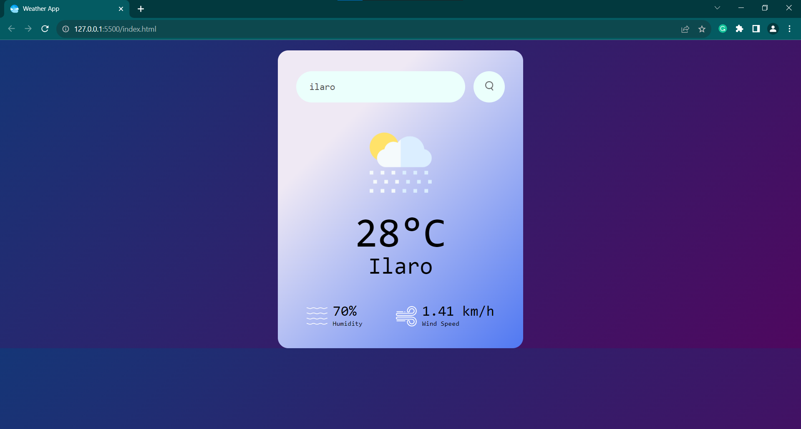

# Weather App

This is a simple weather app that provides weather information for cities using the OpenWeatherMap API.

## Preview

## Features

- Search for weather information by city name.
- Display temperature, city name, humidity, and wind speed.

## Usage

1. Clone the repository.
2. Open `index.html` in a web browser.
3. Enter a city name in the input field and click the search button to get weather information.

## Screenshots

### Home Page

## Website

Visit the [Weather App Website](https://your-website-url.com) for live demo and usage.

## Credits

This project uses data from the [OpenWeatherMap API](https://openweathermap.org/).

